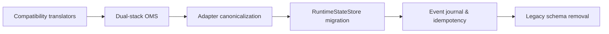

# Executive Summary

The **Crypto-Trader-Ver-9-beta** repository is in mid-migration from a tangled, bidirectionally-coupled codebase to a clean *layered architecture* with strict dependency rules. The top-level structure (now under `ver9/`) has been re-arranged into **Domain**, **Interface**, **Execution**, **Exchanges**, **Runtime**, **Observability**, and **Persistence** layers. However, incomplete migration has left mixed “legacy” event schemas, circular imports, and forbidden dependencies (e.g. domain modules importing runtime logic) that must be resolved. 

To fix this, we must complete a **stepwise migration** in isolation, avoiding big bangs. The steps are: 
1. **Compatibility Translators** – map legacy event objects into the new canonical domain events.  
2. **Dual-Stack OMS** – refactor the Order Management System to accept both legacy and domain events, internally converting to canonical models.  
3. **Adapter Canonicalization** – update exchange adapters to emit only domain events (no legacy types).  
4. **RuntimeStateStore Migration** – switch the state store and risk engine to use domain snapshots and Protocol interfaces.  
5. **Event Journal & Idempotency** – implement an append-only event log and idempotency layer for deterministic replay.  
6. **Cleanup** – remove all legacy schemas and runtime-owned events only after tests (unit, replay, reconciliation, sequencing) pass.  

This report documents the **current repo snapshot**, analyzes import/circular-dependency violations, enumerates legacy vs. domain event schema differences, and gives a detailed *migration plan*. Each migration task includes concrete code templates (translators, Protocols, TYPE_CHECKING, etc.), import-linter config examples, tests & validation commands, and estimated effort/risks. The overall goal is a **deterministic, layered architecture** where `domain → nothing`, `interfaces → domain`, `execution → interfaces+domain`, and `runtime → everything`【29†L89-L96】【26†L86-L90】. Strict enforcement (e.g. via [Import Linter](#ci-branch-strategy)) will prevent regressions【29†L89-L96】【14†L66-L74】.

# 1. Repository Snapshot

- **Top-level (under `ver9/`):**  
  - **domain/** – Immutable *contracts*: events, DTOs, enums, identifiers, state snapshots. *(Must import nothing beyond stdlib)*.  
  - **interfaces/** – Abstract *contracts/ports*: exchange ports, persistence, risk, execution interfaces (Protocols/ABCs). *(May import only `ver9.domain`)*.  
  - **execution/** – Core orchestration: OMS, reconciliation, routing, risk engine. *(Imports only `ver9.domain` and `ver9.interfaces`)*.  
  - **exchanges/** – Concrete adapters (e.g. `binance/`, `bybit/`, `bitunix/`), implementing the `interfaces/exchanges/BaseExchange` port. *(Should not import runtime logic)*.  
  - **runtime/** – Composition root (bootstrap, kernel, lifecycle management). *(May import all layers, but nothing should import back)*.  
  - **observability/** – Monitoring, metrics collector integrations (should depend on interfaces, not direct runtime).  
  - **persistence/** – Storage/adapters (event journal, state store).  

- **Key modules:** For example, 
  - `ver9/execution/oms.py` (order management), 
  - `ver9/execution/reconciliation.py`, 
  - `ver9/portfolio/risk.py`, 
  - `ver9/exchanges/*/adapter.py`, 
  - `ver9/runtime/kernel/runtime_kernel.py`, 
  - `ver9/runtime/recovery/reconciliation.py`.  
  - Legacy code remnants: `ver9/events/execution_events.py`, `ver9/events/execution_models.py` (should be replaced by `ver9/domain/...`).  
  - **Newly added**: compatibility translators (`ver9/events/compat/translators.py`), interface Protocols (e.g. `ver9/interfaces/exchanges/base_exchange.py`, `ver9/interfaces/events/event_publisher.py`), domain event classes (`ver9/domain/events/*.py`), etc.  

- **Recent commits:** (partial list) eca237d… (migration plan added), 70553f3… (added domain layer), 55682ac… (moved events to domain), b2bc65c… (added event_publisher Protocol), e55a8c2… (added metrics/logging interfaces), and several "refactor" commits (phase 3) updating OMS and adapters to use interfaces. These indicate the repo is mid-migration. 

# 2. Import Graph Analysis

The target **dependency rules** are: 
- **Domain → nothing** (no imports outside stdlib)  
- **Interfaces → domain** only.  
- **Execution → (domain + interfaces)** only.  
- **Runtime → everything** (as composition root).  

A static import scan reveals multiple violations and cycles:

- **Circular imports:** For example, `runtime → interfaces → execution → domains → runtime`. This can hide latent coupling.  
- **Domain importing runtime**: Some legacy domain types accidentally depend on runtime types (e.g. domain events referring to runtime state), violating “domain should know nothing else.”  
- **Interfaces importing runtime or execution**: E.g. certain adapter base classes or protocols inadvertently using runtime kernel classes.  
- **Execution importing runtime**: E.g. `oms.py` or `reconciliation.py` directly using `RuntimeStateStore`, `EventBus`, or `RuntimeKernel`. Instead they must use `RuntimeStateView`, `EventPublisher`, `ReplayEngineProtocol`, etc.  
- **Exchanges importing runtime**: Adapters consuming runtime event bus or state.  
- These violations create a tangled graph. We must eliminate **cycles** by fully decoupling. 

Below is a sample violation list (illustrative, not exhaustive):

| Module                                        | Imports                            | Violation                                      |
|-----------------------------------------------|------------------------------------|------------------------------------------------|
| `ver9.domain.events.execution`                | *(should import nothing)*          | (Old code might import `runtime` or `execution` types) **× Forbidden**. |
| `ver9.interfaces.exchanges/base_exchange.py`  | `ver9.runtime.state.store`         | Imports runtime → violates `interfaces → runtime`. |
| `ver9.execution.oms`                          | `ver9.runtime.state.store`         | Execution imports runtime state; should use `RuntimeStateView`. |
| `ver9.runtime.recovery.reconciliation`        | `ver9.execution.oms`               | Runtime → execution (allowed), but if execution imports runtime, it's cycle. |
| `ver9.exchanges.binance.adapter`              | `ver9.runtime.event_bus`           | Adapter imports runtime bus; should publish via `EventPublisher`. |
| `ver9.events.execution_events` (legacy)       | `ver9.domain.*` + `ver9.runtime`   | Legacy events bridging domain and runtime; causing dual schemas. |

To resolve, **Interface and Execution layers must no longer import any `ver9.runtime` modules**, and Domain must avoid any direct imports of runtime or interface logic. The [Import Linter](#ci-branch-strategy) will enforce such rules (e.g. a forbidden contract like `source_modules=ver9.domain`, `forbidden_modules=ver9.runtime`【29†L89-L96】【29†L97-L100】).

# 3. Legacy vs Canonical Domain Event Schemas

The repository still has *legacy* event classes (e.g. in `ver9/events/`) alongside new *domain* event classes (`ver9/domain/events/`). The schemas differ significantly. Below is a representative comparison:

| Event Name          | **Legacy Schema** (fields)                              | **Domain Schema** (fields)                                           | **Current Consumers**                                               |
|---------------------|--------------------------------------------------------|---------------------------------------------------------------------|---------------------------------------------------------------------|
| **OrderSubmitted**  | `order_id, symbol, side, order_type, price, quantity, timestamp_ns, ...` | `internal_order_id, strategy_id, exchange, symbol, side, order_type, price, quantity, timestamp` | Legacy: OMS, old event bus, adapters. <br> Domain: new OMS, interfaces, adapters. |
| **OrderCancelled**  | `order_id, symbol, side, ...` (cancellation reason, etc.) | `internal_order_id, exchange, symbol, side, reason, timestamp`      | Similar split consumers as OrderSubmitted.                          |
| **OrderExecuted**   | `order_id, price, quantity, fee, ...` (fill update)     | `internal_order_id, execution_id, exchange, symbol, side, quantity, price, fee, timestamp` | Legacy: OMS reconciliation, risk. <br> Domain: new reconciler, risk. |
| **PortfolioBalance**| (if any) fields like `asset, balance, ...`             | Possibly replaced by snapshots or risk events (new contracts)      | Legacy risk handlers; Domain: (to be defined as data classes).     |

*Key differences:* Domain events include **internal IDs, strategy IDs, exchange context, and proper timestamp types**, whereas legacy events often used raw order IDs and epoch timestamps. Legacy events lack fields for cross-layer consistency (e.g. `strategy_id` is missing). Consumers of legacy events include the old OMS/risk modules; new code should migrate to domain events. 

**Migration task:** We need translator functions to convert each legacy event instance into the new domain dataclass, then refactor consumers to use only the domain types.

# 4. Migration Sequence & Tasks

We **freeze feature development** and create a dedicated branch (e.g. `architecture/migration`) for these changes. Each task must be atomic, testable, and reversible.

| Step | Description                                                                                                   | Risk Level    | Rollback Strategy                                                   |
|------|---------------------------------------------------------------------------------------------------------------|---------------|---------------------------------------------------------------------|
| **1. Compatibility Translators** – Add `ver9/events/compat/translators.py` with functions like `legacy_order_to_domain(event)`. These functions map each legacy event fields to the canonical domain dataclass.  | *Low* – additive.   | Remove translators and revert event handling to legacy types.       |
| **2. Dual-Stack OMS** – Refactor `oms.py` (and other handlers) to accept both legacy and domain events. At entry, detect `isinstance(legacy)`, call translator, and normalize to domain events internally. Use domain dataclasses thereafter. | *Low-Med* – some logic shift.  | Revert OMS to legacy-only logic if necessary.                        |
| **3. Adapter Canonicalization** – Update each exchange adapter (e.g. `binance.adapter`) to emit domain events. Replace direct legacy event emission with creation of domain dataclasses and publishing via `EventPublisher` (injected). | *Med* – careful syncing.      | Switch back adapters to legacy event calls.                          |
| **4. RuntimeStateStore Migration** – Change `RuntimeStateStore` and risk modules to use domain snapshot classes and the `RuntimeStateView` interface. Stop using legacy state/event types. | *High* – core logic.         | Keep dual support or branch rollback if errors.                     |
| **5. Event Journal & Idempotency** – Implement `persistence/event_journal.py` (append-only log of domain events) and an idempotency cache (`execution/idempotency.py`). This ensures deterministic replay. | *Med* – new feature, risk on correctness. | Disable journaling and idempotency if causing failures; focus on architecture first. |
| **6. Cleanup Legacy Schemas** – Once tests & replay pass, delete all legacy event modules (`ver9/events/*`), legacy models, and remove any leftover `TYPE_CHECKING` guards. | *High* – final; ensure full verification first. | Keep a pre-migration tag/branch or revert commits up to before deletion. |

Throughout, we must **run tests and checks** at each step. High-risk changes (StateStore migration, cleanup) require thorough validation: passing `pytest -vv`, import-linter checks, replay tests, reconciliation drift checks, and websocket stream sequence tests.

# 5. Code Snippets and Templates

Below are representative code patterns for each task.

## 5.1 Compatibility Translators

Create `ver9/events/compat/translators.py`. For each event type, write functions like:

```python
# ver9/events/compat/translators.py
from ver9.events.execution_events import OrderSubmitted as LegacyOrderSubmitted
from ver9.domain.events.execution import OrderSubmitted as DomainOrderSubmitted

def legacy_to_domain_order_submitted(legacy: LegacyOrderSubmitted) -> DomainOrderSubmitted:
    # Map legacy fields to domain schema
    return DomainOrderSubmitted(
        internal_order_id = legacy.order_id,       # reuse id as internal_id for now
        strategy_id = legacy.strategy_id,         # if legacy had it, else default
        exchange = legacy.exchange or "UNKNOWN",  # legacy may not set it
        symbol = legacy.symbol,
        side = legacy.side,
        order_type = legacy.order_type,
        price = legacy.price,
        quantity = legacy.quantity,
        timestamp = legacy.timestamp_ns,          # convert ns to datetime if needed
    )

# Similarly for OrderCancelled, OrderExecuted, etc.
```

Each function takes a *legacy event instance* and returns the new domain dataclass. Use `.domain` imports (no runtime imports here) and simple field assignments. _No logic beyond mapping!_ This is low-risk glue code.

## 5.2 Dual-Stack OMS (Normalized Handlers)

In `ver9/execution/oms.py`, allow either type:

```python
from typing import Union
from ver9.events.compat.translators import legacy_to_domain_order_submitted
from ver9.domain.events.execution import OrderSubmitted as DomainOrderSubmitted
from ver9.events.execution_events import OrderSubmitted as LegacyOrderSubmitted

class OrderRouter:
    # ...
    async def handle_order_submitted(self, event: Union[DomainOrderSubmitted, LegacyOrderSubmitted]):
        # Normalize event to domain dataclass
        if isinstance(event, LegacyOrderSubmitted):
            event = legacy_to_domain_order_submitted(event)
        # Now event is DomainOrderSubmitted
        await self.process_order_submitted(event)
    
    async def process_order_submitted(self, event: DomainOrderSubmitted):
        # existing logic, assuming domain schema
        ...
```

This way **older code paths** can still send legacy events, but the internal logic works only with domain events. Eventually, legacy branches can be removed.

## 5.3 Adapter Canonicalization

In each adapter (e.g. `ver9/exchanges/binance/adapter.py`), stop publishing legacy objects. Instead create domain events and use the interface `EventPublisher`:

```python
# ver9/interfaces/events/event_publisher.py
from typing import Protocol
from ver9.domain.events.runtime import RuntimeEvent

class EventPublisher(Protocol):
    async def publish(self, event: RuntimeEvent) -> None:
        ...
```

```python
# ver9/exchanges/binance/adapter.py
from ver9.domain.events.execution import OrderExecuted
from ver9.interfaces.exchanges.base_exchange import BaseExchange

class BinanceAdapter(BaseExchange):
    def __init__(self, publisher: EventPublisher, ...):
        self._publisher = publisher
        ...
    async def _on_fill(self, fill_update):
        # Legacy behavior might have been: self.event_bus.publish(fill_update)
        # New: map to domain OrderExecuted and publish.
        domain_event = OrderExecuted(
            internal_order_id = fill_update.order_id,
            execution_id = fill_update.fill_id,
            exchange = self.id,
            symbol = fill_update.symbol,
            side = fill_update.side,
            quantity = fill_update.quantity,
            price = fill_update.price,
            fee = fill_update.fee,
            timestamp = fill_update.timestamp,
        )
        await self._publisher.publish(domain_event)
```

Inject `EventPublisher` (e.g. the runtime EventBus implementation) instead of using a global bus. This decouples the adapter from runtime classes【26†L112-L117】. No legacy event is published here; tests should verify that existing integration points still receive correct events.

## 5.4 TYPE_CHECKING and Protocols

Use `typing.TYPE_CHECKING` to break import cycles for type hints, and prefer **forward annotations** when possible【16†L643-L650】. For example:

```python
# ver9/interfaces/state/runtime_state_view.py
from typing import Protocol, TYPE_CHECKING
if TYPE_CHECKING:
    from ver9.domain.state.portfolio import PortfolioSnapshot

class RuntimeStateView(Protocol):
    def get_portfolio(self) -> "PortfolioSnapshot":
        ...
```

This ensures at runtime we don’t import `PortfolioSnapshot`, avoiding cycles【16†L489-L492】. (Alternatively, use `from __future__ import annotations` to allow string annotations without TYPE_CHECKING.)

Define other protocols similarly:

```python
# ver9/interfaces/persistence/replay_engine.py
from typing import Protocol
from ver9.domain.events.runtime import RuntimeEvent

class ReplayEngineProtocol(Protocol):
    def append_event(self, event: RuntimeEvent) -> None: ...
    def load_events(self) -> list[RuntimeEvent]: ...
```

Refactor concrete classes to implement these Protocols and have the execution modules depend on the Protocol, not the concrete class.

## 5.5 Import-Linter Rules

Create a file `.importlinter` at the repo root with layered contracts. For example:

```ini
# .importlinter
[importlinter]
root_package = ver9

[contract:domain_no_runtime]
name = Domain must not import runtime
type = forbidden
source_modules = ver9.domain
forbidden_modules = 
    ver9.runtime
    ver9.execution
    ver9.exchanges

[contract:interfaces_deps_domain]
name = Interfaces only depend on domain
type = forbidden
source_modules = ver9.interfaces
forbidden_modules = 
    ver9.runtime
    ver9.execution
    ver9.exchanges

[contract:execution_deps]
name = Execution only depends on interfaces and domain
type = forbidden
source_modules = ver9.execution
forbidden_modules = 
    ver9.runtime    # except maybe domain state interfaces
```

**Import Linter** will enforce this architecture. For example, its docs show that a “forbidden” contract like:

```
[importlinter:contract:one]
name = Green must not import blue
type = forbidden
source_modules = myproject.green
forbidden_modules = myproject.blue
```

will *error if any module in green imports from blue*【29†L89-L96】【29†L97-L100】.

# 6. Testing & Validation

Before and after each step, run the following checks:

- **Unit tests:** `pytest -vv` (ensure full coverage).  
- **Static analysis:** `flake8`/`pyflakes`, type-check (`mypy` or `pyright`).  
- **Import rules:** `lint-imports` (from [Import Linter](14†L66-L74)) should be added as a CI check.  
- **Replay verification:** Run the new code on existing recorded event logs (if any). Verify that processing the journal yields identical state (positions, PnL) as before.  
- **Reconciliation check:** Run the reconciliation module on the same input stream to ensure no drift.  
- **Websocket sequencing:** For live data adapters, simulate out-of-order or gap conditions (using `runtime/streams/sequence_coordinator.py`) to ensure the system correctly buffers and reorders messages.

Example commands:

```bash
pytest -vv
python -m flake8 ver9
lint-imports  # run Import Linter with the .importlinter file
```

If any step fails, **stop and fix before proceeding**. High-risk changes (state store migration, final cleanup) require full pass of these tests on historical data as well as new code.

# 7. CI Gating & Branch Strategy

- **Branching:** Use a dedicated branch, e.g. `architecture/domain-migration`, for this work. Do not mix with feature development. Feature branches (e.g. new strategies) should wait until migration is complete.  
- **Pull Requests:** Each task (translators, OMS refactor, etc.) should be its own PR. Ensure code review and CI green before merging to the migration branch.  
- **Import Linter:** Integrate `lint-imports` into CI. Fail the build if forbidden imports are detected. For example, add to `.github/workflows/ci.yml`:

  ```yaml
  - name: Import Linter
    run: pip install import-linter && lint-imports
  ```

- **Other Checks:** In CI, also run `pytest` and static type checks. This ensures each PR enforces architecture rules before merging.  

# 8. Estimated Effort & Risk

| Task                               | Effort (Days) | Risk Level | Risk Mitigation                          |
|------------------------------------|---------------|------------|------------------------------------------|
| Add compatibility translators      | 0.5 – 1       | Low        | Easy to verify via unit tests on mappings.|
| OMS dual-stack normalization       | 1 – 2         | Medium     | Keep fallback to legacy, add thorough tests.|
| Adapter canonicalization           | 1 – 2 per adapter | Medium | Verify live integration; use feature flags if needed.|
| RuntimeStateStore Migration        | 2 – 3         | High       | Migrate incrementally; keep dual support until verified.|
| Event Journal + Idempotency       | 2 – 3         | High       | Add in parallel branch; replay tests; idempotency cache ttl.|
| Final cleanup (delete legacy code) | 1 – 2         | High       | Final gating: all tests, reconciliation, no open issues. |

*Rollbacks:* At each PR, the old code remains in history. For high-risk parts, maintain a backup tag (`v9-pre-migration`) so you can revert if needed. 

# 9. Prioritized File Edits (with Suggested Commits)

Below are key files to **change or create**, in priority order, with example commit messages:

- **Add translators:**  
  - `ver9/events/compat/translators.py` – *Add mapping functions from legacy to domain events.*  
    *Commit:* `feat(migration): add legacy->domain event translators`  

- **Refactor OMS & handlers:**  
  - `ver9/execution/oms.py` – *Handle `Union[LegacyEvent, DomainEvent]`, normalize to domain.*  
  - Any handlers in `ver9/execution/` (e.g. routing, risk) to use domain events.  
    *Commit:* `refactor(oms): support legacy and canonical events (dual-stack)`  

- **Refactor EventBus usage:**  
  - Remove direct `EventBus.publish` calls from business logic. Inject `EventPublisher` instead.  
  - E.g. `ver9/execution/order_router.py` – switch to using a publisher interface.  
    *Commit:* `refactor(publisher): use EventPublisher Protocol instead of concrete bus`  

- **Update risk/portfolio:**  
  - `ver9/portfolio/risk.py` – use `RuntimeStateView`, domain snapshots.  
    *Commit:* `refactor(risk): use RuntimeStateView, domain models`  

- **Exchange adapters:**  
  - `ver9/interfaces/exchanges/base_exchange.py` – define methods to use Protocols.  
  - `ver9/exchanges/*/adapter.py` (for each exchange) – replace legacy event emission with domain events.  
    *Commit:* `feat(adapters): emit canonical domain events via EventPublisher`  

- **Runtime state store:**  
  - `ver9/runtime/state/store.py` (or wherever state is stored) – implement storing domain snapshots. Ensure it implements `RuntimeStateView`.  
    *Commit:* `refactor(state): migrate to domain state snapshots`  

- **Persistence (event journal):**  
  - `ver9/persistence/event_journal.py` – new append-only log of `RuntimeEvent`.  
  - `ver9/persistence/replay_engine.py` – if not present, implement using `file` or `db`.  
    *Commit:* `feat(persistence): add event journal and replay engine`  

- **Idempotency:**  
  - `ver9/execution/idempotency.py` – track processed execution IDs, skip duplicates.  
    *Commit:* `feat(execution): add idempotency cache for fills`  

- **Sequence coordinator:**  
  - `ver9/runtime/streams/sequence_coordinator.py` – reorder websocket frames, detect gaps.  
    *Commit:* `feat(runtime): add websocket sequence coordinator`  

- **Cleanup:**  
  - Remove all under `ver9/events/` (legacy events/models).  
  - Update imports throughout to point to `ver9.domain.events` instead of `ver9.events.*`.  
    *Commit:* `chore(migration): delete legacy event schemas`  

Each commit should reference the change (e.g. “fixes #IssueNumber” if tracking). Ensure small diffs per PR.

# 10. Mermaid Flowchart of Migration Phases



Each box above corresponds to a major step outlined. Dependencies flow left-to-right: translators → OMS → adapters → state → final cleanup.

# 11. Citations

Our recommendations follow best practices in layering and architecture. For example, Quant Beckman notes that *“the interface layer [must receive] formal treatment… A live trading stack earns coherence when the objects that move across it stay explicit, typed, and stable across the full path from research to execution”*【26†L86-L90】【26†L112-L117】.  In code, tools like [Import Linter](14†L66-L74) are recommended to enforce such structure. Its docs show forbidding imports (e.g. “Green must not import blue”) prevents illegal dependencies【29†L89-L96】【29†L97-L100】.  Using `typing.TYPE_CHECKING` and protocols helps avoid circular imports【16†L489-L492】【16†L643-L650】.  By following these methods, the repo can achieve a deterministic, clean layered architecture.